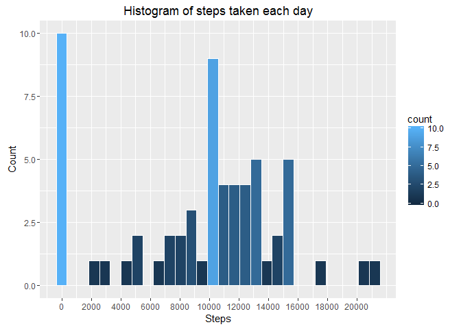
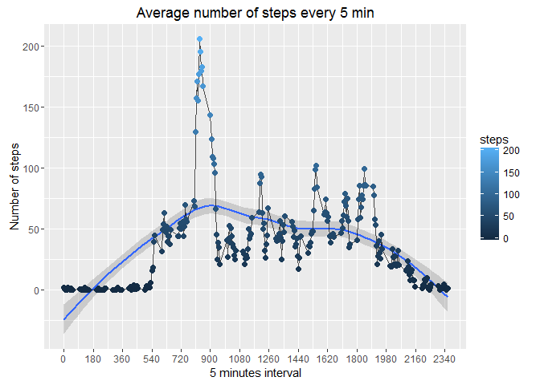
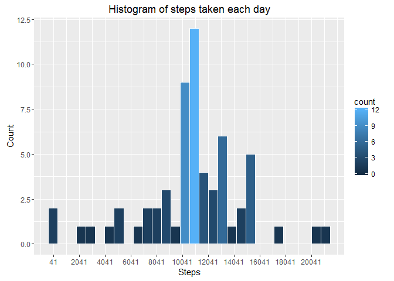
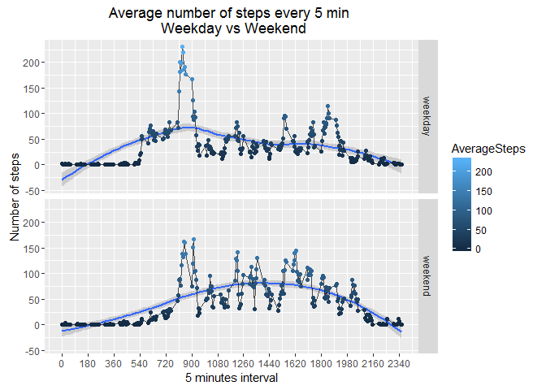

# Reproducible Research: Peer Assessment 1

### Loading required packages


```r
require("dplyr")
require("ggplot2")
```

### Loading and preprocessing the data


```r
# Loading the data into the activityData dataframe
activityData <- read.csv(unz("activity.zip", "activity.csv"))
```


### What is mean total number of steps taken per day?

1. **Calculate the total number of steps taken per day**

```r
# Calculate the sum of steps taken each date
totalStepsPerDay <- with(activityData, tapply(steps, date, sum, na.rm = TRUE))

# Convert the steps taken each date into a dataframe
stepsPerDayDF <- data.frame(Date = names(totalStepsPerDay),
                            steps = totalStepsPerDay,
                            row.names = NULL,
                            stringsAsFactors = FALSE)

# Convert the Date from character to as.POSIXct
stepsPerDayDF$Date <- as.POSIXct(stepsPerDayDF$Date, format="%Y-%m-%d")

stepsPerDayDF
```

```
##          Date steps
## 1  2012-10-01     0
## 2  2012-10-02   126
## 3  2012-10-03 11352
## 4  2012-10-04 12116
## 5  2012-10-05 13294
## 6  2012-10-06 15420
## 7  2012-10-07 11015
## 8  2012-10-08     0
## 9  2012-10-09 12811
## 10 2012-10-10  9900
## 11 2012-10-11 10304
## 12 2012-10-12 17382
## 13 2012-10-13 12426
## 14 2012-10-14 15098
## 15 2012-10-15 10139
## 16 2012-10-16 15084
## 17 2012-10-17 13452
## 18 2012-10-18 10056
## 19 2012-10-19 11829
## 20 2012-10-20 10395
## 21 2012-10-21  8821
## 22 2012-10-22 13460
## 23 2012-10-23  8918
## 24 2012-10-24  8355
## 25 2012-10-25  2492
## 26 2012-10-26  6778
## 27 2012-10-27 10119
## 28 2012-10-28 11458
## 29 2012-10-29  5018
## 30 2012-10-30  9819
## 31 2012-10-31 15414
## 32 2012-11-01     0
## 33 2012-11-02 10600
## 34 2012-11-03 10571
## 35 2012-11-04     0
## 36 2012-11-05 10439
## 37 2012-11-06  8334
## 38 2012-11-07 12883
## 39 2012-11-08  3219
## 40 2012-11-09     0
## 41 2012-11-10     0
## 42 2012-11-11 12608
## 43 2012-11-12 10765
## 44 2012-11-13  7336
## 45 2012-11-14     0
## 46 2012-11-15    41
## 47 2012-11-16  5441
## 48 2012-11-17 14339
## 49 2012-11-18 15110
## 50 2012-11-19  8841
## 51 2012-11-20  4472
## 52 2012-11-21 12787
## 53 2012-11-22 20427
## 54 2012-11-23 21194
## 55 2012-11-24 14478
## 56 2012-11-25 11834
## 57 2012-11-26 11162
## 58 2012-11-27 13646
## 59 2012-11-28 10183
## 60 2012-11-29  7047
## 61 2012-11-30     0
```
2. **Make a histogram of the steps taken each day**

```r
xTickMarks = seq(min(stepsPerDayDF$steps), max(stepsPerDayDF$steps), by = 2000)

ggplot(data = stepsPerDayDF, aes(steps)) + 
   geom_histogram(aes(fill = ..count..), col = "white") +
   labs(title = "Histogram of steps taken each day", x = "Steps", y = "Count") +      
   scale_x_continuous(breaks = xTickMarks)
```

<!-- -->

3. **Report the mean and median of the total number of steps taken per day**

```r
mean(stepsPerDayDF$steps)
```

```
## [1] 9354.23
```

```r
median(stepsPerDayDF$steps)
```

```
## [1] 10395
```

## What is the average daily activity pattern?

1. **Make a time series plot of the 5-minute interval (x-axis) and the average number of steps taken, averaged across all days (y-axis)**

```r
# Calculate the average number of steps in a 5-minute interval
averageSteps5min <- with(activityData, tapply(steps, interval, mean, na.rm = TRUE))

# Coverrt the average number of steps into a data frame
steps5minDF <- data.frame(timeInterval = names(averageSteps5min),
                            steps = averageSteps5min,
                            row.names = NULL,
                            stringsAsFactors = FALSE)

steps5minDF$timeInterval <- as.numeric(steps5minDF$timeInterval)
timeSequence = seq(min(steps5minDF$timeInterval), max(steps5minDF$timeInterval), by = 180)

ggplot(steps5minDF, aes(timeInterval, steps)) + 
   geom_smooth(aes(x = timeInterval, y = steps)) +
   geom_line(color = "black", alpha = 0.7) +
   geom_point(aes(color = steps), size = 2) + 
   labs(title = "Average number of steps every 5 min", x = "5 minutes interval", y = "Number of steps") +
   scale_x_continuous(breaks = timeSequence)
```

<!-- -->

2. **Which 5-minute interval, on average across all the days in the dataset, contains the maximum number of steps?**

```r
steps5minDF$timeInterval[steps5minDF$steps == max(steps5minDF$steps)]
```

```
## [1] 835
```

## Imputing missing values

1. **Calculate and report the total number of missing values in the dataset**

```r
sum(is.na(activityData$steps) == TRUE)
```

```
## [1] 2304
```

2. **Create a new dataset that is equal to the original dataset but with the missing data filled in with the mean values of the average number of steps taken in 5-minutes intervals**


```r
# Create a estimatedActivity dataframe where missing data will be filled in with estimate of the steps taken every 5-minutes interval
estimatedActivity <- activityData

# Fill in missing valures with the average number of steps taken in 5-minutes intervals
estimatedActivity$steps[is.na(estimatedActivity$steps)] <- steps5minDF$steps[match(estimatedActivity$interval, steps5minDF$timeInterval)][which(is.na(estimatedActivity$steps))]
```

2. **Make a histogram of the steps taken each day with missing values filled in** 

```r
estimatedStepsPerDay <- with(estimatedActivity, tapply(steps, date, sum, na.rm = TRUE))

# Create a data frame with total steps per date
estimatedStepsPerDayDF <- data.frame(date = names(estimatedStepsPerDay),
                            steps = estimatedStepsPerDay,
                            row.names = NULL,
                            stringsAsFactors = FALSE)

xTickMarks = seq(min(estimatedStepsPerDayDF$steps), max(estimatedStepsPerDayDF$steps), by = 2000)

ggplot(data = estimatedStepsPerDayDF, aes(steps)) + 
   geom_histogram(aes(fill = ..count..), col = "white") +
   labs(title = "Histogram of steps taken each day", x = "Steps", y = "Count") +      
   scale_x_continuous(breaks = xTickMarks)
```

```
## `stat_bin()` using `bins = 30`. Pick better value with `binwidth`.
```

<!-- -->

4. **Report the mean and median of the total number of steps taken per day**

```r
mean(estimatedStepsPerDayDF$steps)
```

```
## [1] 10766.19
```

```r
median(estimatedStepsPerDayDF$steps)
```

```
## [1] 10766.19
```

## Are there differences in activity patterns between weekdays and weekends?

1. **Create a new factor variable in the dataset with two levels - "weekday" and "weekend" indicating whether a given date is a weekday or weekend day**

```r
# Convert the date from character to as.POSIXct
estimatedActivity$date <- as.POSIXct(estimatedActivity$date, format="%Y-%m-%d")

# create a vector of weekdays
weekdays1 <- c('Monday', 'Tuesday', 'Wednesday', 'Thursday', 'Friday')

# Generate a new column with values "weekday" and "weekend" indicating whether a given date is a weekday or weekend day
estimatedActivity$wDay <- c('weekend', 'weekday')[(weekdays(estimatedActivity$date) %in% weekdays1)+1L]
```

2. **Make a panel plot containing a time series plot of the 5-minute interval (x-axis) and the average number of steps taken, averaged across all weekday days or weekend days (y-axis)**

```r
# Calculate the average number of steps for every 5 minutes interval for both weekends and weekdays
dayaverage <- estimatedActivity %>%
   group_by(interval, wDay) %>%
   summarize(AverageSteps=mean(steps))


xTickMarks = seq(min(dayaverage$interval), max(dayaverage$interval), by = 180)

ggplot(dayaverage, aes(interval, AverageSteps)) +
   geom_smooth(aes(x = interval, y = AverageSteps)) +
   geom_line(color = "black", alpha = 0.7) +
   geom_point(aes(color = AverageSteps), size = 1.5) +
   facet_grid(wDay ~ .) +
   labs(title = "Average number of steps every 5 min \n Weekday vs Weekend", x = "5 minutes interval", y = "Number of steps") +
   scale_x_continuous(breaks = xTickMarks)
```

<!-- -->
